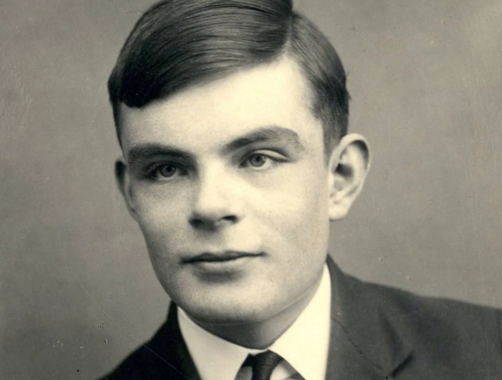

# Pratyush Chand

[I don't care about you as a programmer](#as-a-person)

## As a programmer:
**Programmming Languages**: *Java, Python, C++, ARM Assembly, JavaScript, HTML, CSS*

**Software & Tools**: *React Native, Node.js, MongoDB, Postman, REST API’s, Pandas, NLTK, Tensorflow, Pytorch, MATLAB, Matplotlib, Selenium, Jupyter, Ubuntu, Git*

**Favorite CS quote**:

> “Instead of trying to produce a
program to simulate the adult mind,
why not rather try to produce one
which simulates the child’s?
If this were then subjected to an
appropriate course of education
one would obtain the adult brain.”

**Short Programming Snippet in different languages of the single best line of code ever written**
```
Console.log("Hello World")
System.out.println("Hello World")
cout << "Hello World" << endl;
print('Hello World')
```

## As a person:

I am big on music and have been drumming for over a decade now. My favorite drummer, currently, is Larnell Lewis. My favorite performance of his was [Chick's Pain](https://www.youtube.com/watch?v=vIW72VXMPHo).

[Don't don't go here](underConstruction.md)

I also love watching TV shows so here are some of my favorites:
* The Good Place
* Parks and Recreation
* Psych
* Sherlock
* The Office
* Upload


Uh oh! How are you going to learn about me if I only give you an unordered list of my favorite shows, I gotta rank them! So here they are again as an ordered list:

1. The Office
2. Parks and Recreation
3. Upload
4. Sherlock
5. Psych
6. The Good Place

Lastly, let me leave you with my bucket list. I'll keep checking these off as I complete them


- [x] Paraglide at Gliderport
- [ ] Sky Dive in Abu Dhabi
- [ ] Travel to Europe
- [ ] Live in New York for 1 year


